# 🏗️ Ween Backend - Architecture & Flow Documentation

## 📋 Table of Contents

1. **[System Architecture](#system-architecture)**
2. **[Data Flow Diagrams](#data-flow-diagrams)**
3. **[Core Workflows](#core-workflows)**
4. **[Database Schema Design](#database-schema-design)**
5. **[Security Architecture](#security-architecture)**
6. **[Scalability & Performance](#scalability--performance)**

---

## System Architecture

### Layered Architecture Pattern

Ween Backend follows a **4-layer architecture** with clear separation of concerns:

```
┌─────────────────────────────────────────────────────┐
│          Presentation Layer (REST API)               │
│  Controllers handle HTTP requests and responses      │
└──────────────────────┬──────────────────────────────┘
                       │
┌──────────────────────▼──────────────────────────────┐
│          Service Layer (Business Logic)              │
│  Services contain core business rules and workflows  │
└──────────────────────┬──────────────────────────────┘
                       │
┌──────────────────────▼──────────────────────────────┐
│       Repository Layer (Data Access Object)          │
│   Repositories manage database operations (CRUD)     │
└──────────────────────┬──────────────────────────────┘
                       │
┌──────────────────────▼──────────────────────────────┐
│          Persistence Layer (Database)                │
│              MySQL 8.0 Database                      │
└─────────────────────────────────────────────────────┘
```

### Component Breakdown

| Layer | Components | Responsibility |
|-------|-----------|-----------------|
| **Presentation** | Controllers (9 total) | HTTP endpoint handling, request validation, response formatting |
| **Service** | Services (13 total) | Business logic, workflows, calculations, external service integration |
| **Data Access** | Repositories, EntityManagers | Query execution, ORM mapping, transaction management |
| **Persistence** | MySQL Database | Data storage, indexing, relationships |

### Cross-Cutting Concerns

```
┌─────────────────────────────────────────────────────┐
│  Security (Spring Security, JWT, RBAC)              │
│  Logging & Monitoring (SLF4J, JaCoCo)               │
│  Error Handling (Exception Handlers, Advice)        │
│  Validation (Bean Validation, Custom Validators)    │
│  Async Processing (Async Executors, Task Scheduling)│
│  Caching & Rate Limiting (Redis, Bucket4j)          │
└─────────────────────────────────────────────────────┘
          ↓
   [All Four Layers Above]
```

---

## Data Flow Diagrams

### 1. User Registration & Authentication Flow

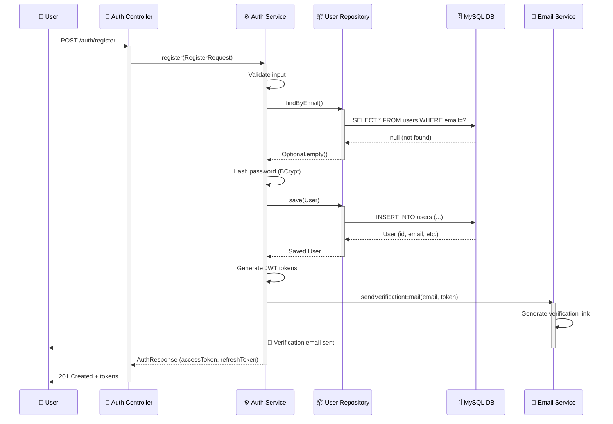

### 2. Event Discovery & Filtering Flow

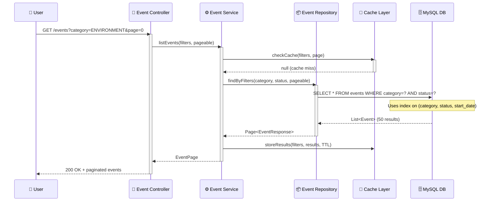

### 3. Event Registration & Capacity Management Flow

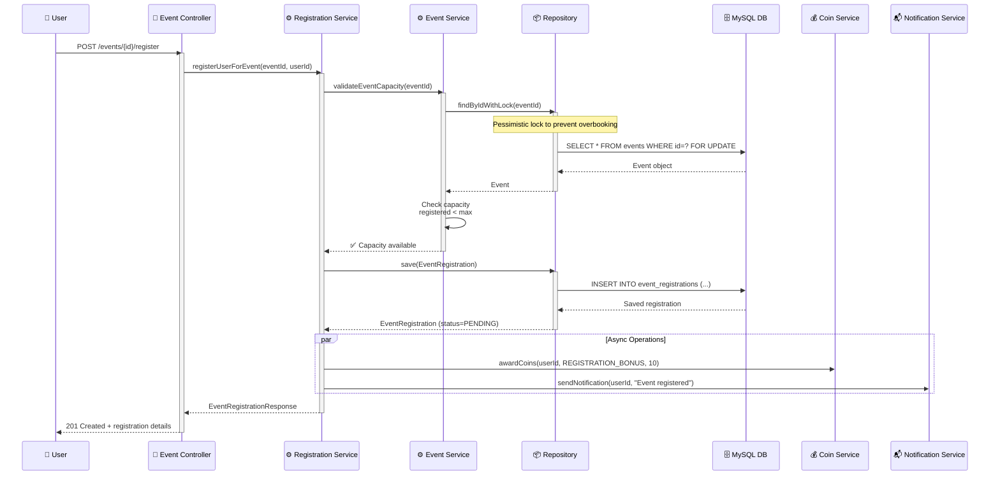

### 4. Certificate Generation & QR Code Flow

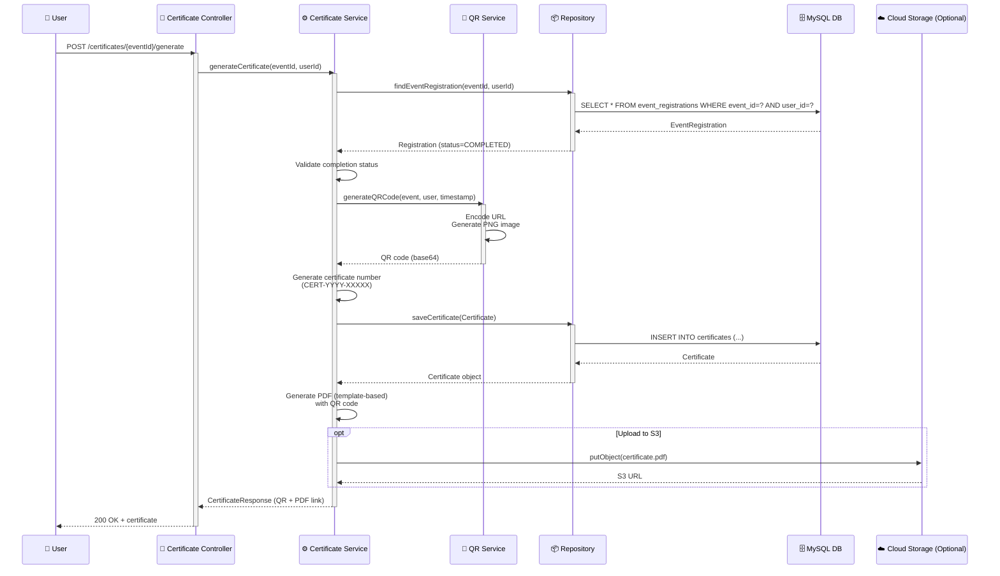

### 5. Gamification: Coin & Leaderboard Flow

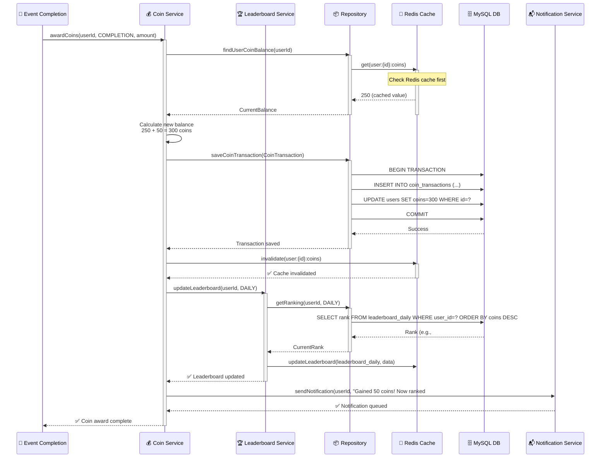

### 6. Admin Analytics & Reporting Flow

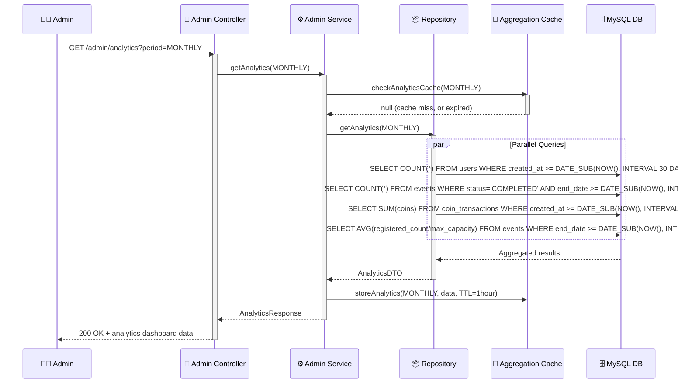

---

## Core Workflows

### Workflow 1: User Registration to First Event

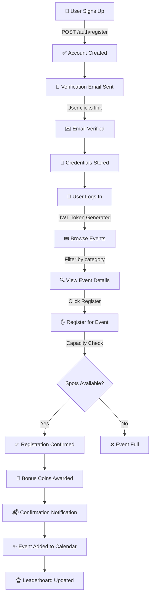

### Workflow 2: Event Completion to Certificate

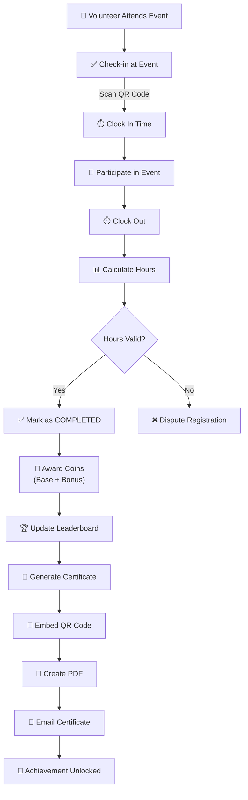

### Workflow 3: Authorization & Access Control

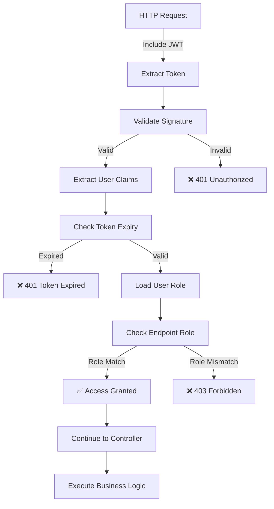

---

## Database Schema Design

### Entity Relationship Diagram

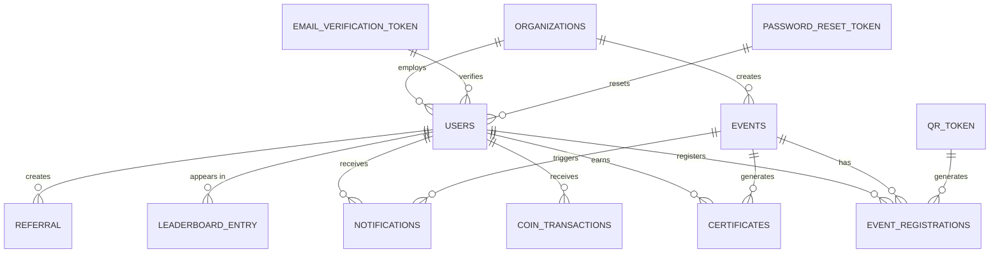

### Key Database Design Decisions

| Decision | Rationale | Implementation |
|----------|-----------|-----------------|
| **Binary UUID** | Efficient storage vs string UUIDs | BINARY(16) for all IDs |
| **Soft Deletes** | Maintain historical data | `deleted_at` timestamp (nullable) |
| **Temporal Tracking** | Audit trail for compliance | `created_at`, `updated_at` on all entities |
| **Indexing Strategy** | Query optimization | Multi-column indexes on frequently filtered columns |
| **Pessimistic Locking** | Prevent race conditions | `FOR UPDATE` on capacity checks |
| **Enum Storage** | Type safety + query efficiency | `ENUM` type for status fields |
| **Batch Operations** | Reduce database roundtrips | Hibernate batch size = 10 |
| **Connection Pooling** | Efficient resource management | HikariCP (20 max, 5 min) |

### Index Strategy

```sql
-- Users Table Indexes
CREATE INDEX idx_email ON users(email);
CREATE INDEX idx_username ON users(username);
CREATE INDEX idx_referral_code ON users(referral_code);

-- Events Table Indexes
CREATE INDEX idx_organization_id ON events(organization_id);
CREATE INDEX idx_status ON events(status);
CREATE INDEX idx_start_date ON events(start_date);
CREATE INDEX idx_category_status ON events(category, status, start_date);

-- Event Registrations Indexes
CREATE INDEX idx_event_id ON event_registrations(event_id);
CREATE INDEX idx_user_id ON event_registrations(user_id);
CREATE INDEX idx_status ON event_registrations(status);
CREATE UNIQUE INDEX idx_unique_registration ON event_registrations(event_id, user_id);

-- Leaderboard Indexes
CREATE INDEX idx_period_rank ON leaderboard_entry(period, rank);
CREATE INDEX idx_user_period ON leaderboard_entry(user_id, period);

-- Coin Transactions Indexes
CREATE INDEX idx_user_id ON coin_transactions(user_id);
CREATE INDEX idx_created_at ON coin_transactions(created_at);
```

---

## Security Architecture

### Authentication Flow

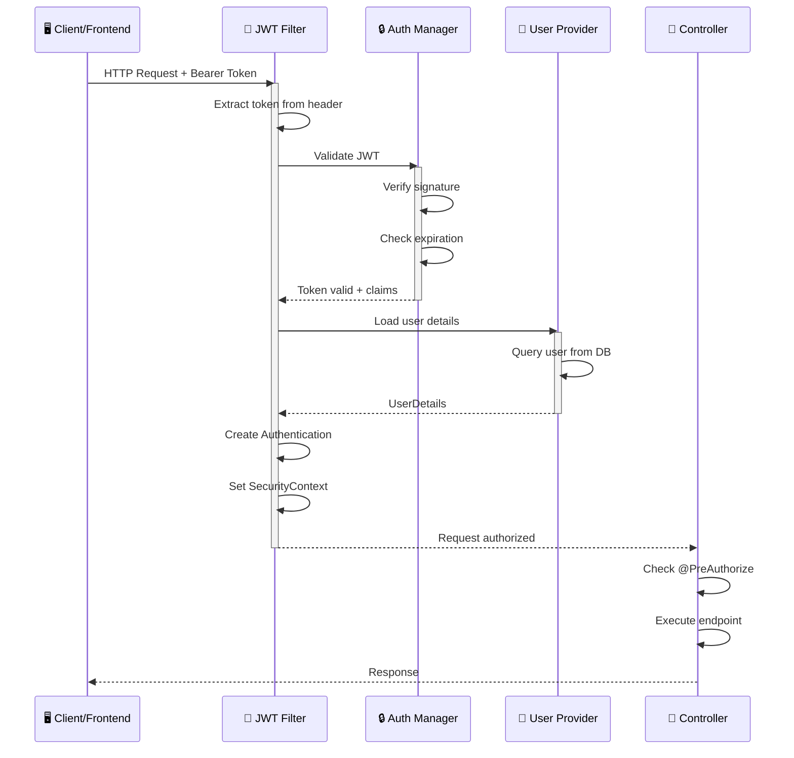

### Security Layers

| Layer | Security Mechanism | Implementation |
|-------|-------------------|-----------------|
| **Transport** | HTTPS/TLS | Enforced in production |
| **Authentication** | JWT Tokens | HS256 signature, token expiry |
| **Authorization** | RBAC + @PreAuthorize | Role-based method security |
| **Input Validation** | Bean Validation + Custom | @NotNull, @Email, @Size, custom validators |
| **SQL Injection** | Parameterized queries | JPA/Hibernate ORM |
| **CSRF** | CSRF tokens | Disabled for stateless API |
| **Rate Limiting** | Bucket4j | Token bucket algorithm |
| **Encryption** | AES-256 | Sensitive field encryption |

### JWT Structure

```json
{
  "header": {
    "alg": "HS256",
    "typ": "JWT"
  },
  "payload": {
    "sub": "user-uuid",
    "username": "john_doe",
    "email": "john@example.com",
    "role": "USER",
    "iat": 1704067200,
    "exp": 1704153600
  }
}
```

---

## Scalability & Performance

### Caching Strategy

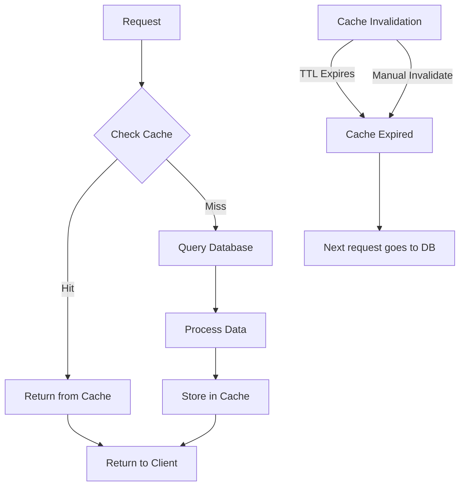

### Caching Layers

| Cache Type | Technology | Use Case | TTL |
|-----------|-----------|----------|-----|
| **Query Results** | Redis / Local | Event lists, leaderboards | 15-60 min |
| **User Sessions** | In-Memory | Active user data | Session lifetime |
| **Computed Data** | Redis | Analytics, aggregations | 1 hour |
| **Warm Data** | DB Query Cache | Frequently accessed events | DB-dependent |

### Performance Metrics

| Metric | Target | Implementation |
|--------|--------|-----------------|
| **Response Time** | < 200ms (p95) | Caching, indexing, pagination |
| **QPS** | 1000+ requests/sec | Connection pooling, async processing |
| **Database Queries** | < 2 per request | Query optimization, N+1 prevention |
| **Memory Usage** | < 1GB baseline | Lazy loading, pagination |

### Async Processing

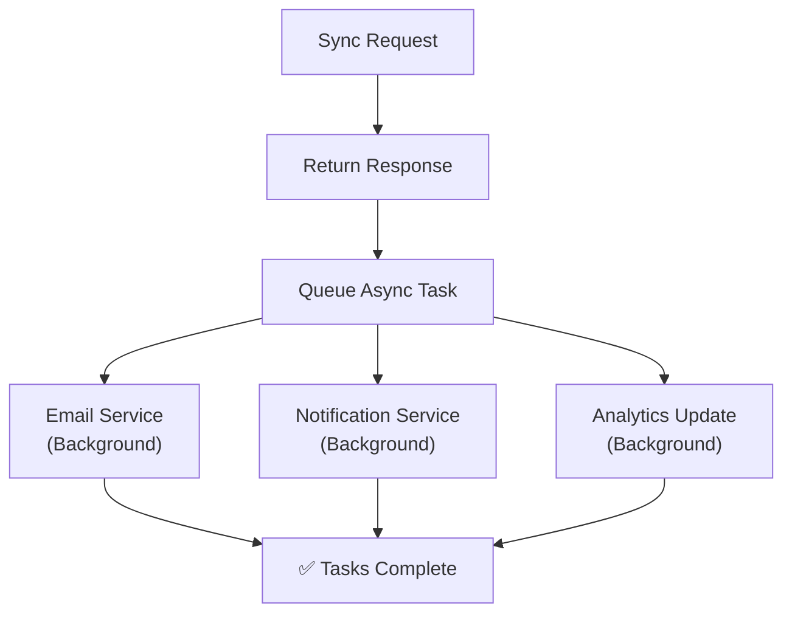

### Horizontal Scaling Considerations

```
┌──────────────────────────────────────────────────────┐
│              Load Balancer (Nginx)                    │
└──────┬──────────────────────────────────────────────┘
       │
   ┌───┴───┬───────────┬───────────┐
   │       │           │           │
┌──▼──┐ ┌──▼──┐    ┌──▼──┐    ┌──▼──┐
│App1 │ │App2 │    │App3 │    │App4 │
└──┬──┘ └──┬──┘    └──┬──┘    └──┬──┘
   │       │          │          │
   └───┬───┴──────────┴──────────┘
       │
   ┌───▼────────────────────────┐
   │ Centralized Database       │
   │ (MySQL + Replication)      │
   └────────────────────────────┘
       │
   ┌───▼────────────────────────┐
   │ Shared Cache               │
   │ (Redis Cluster)            │
   └────────────────────────────┘
```

---

## Event Status Transitions

### Valid State Transitions

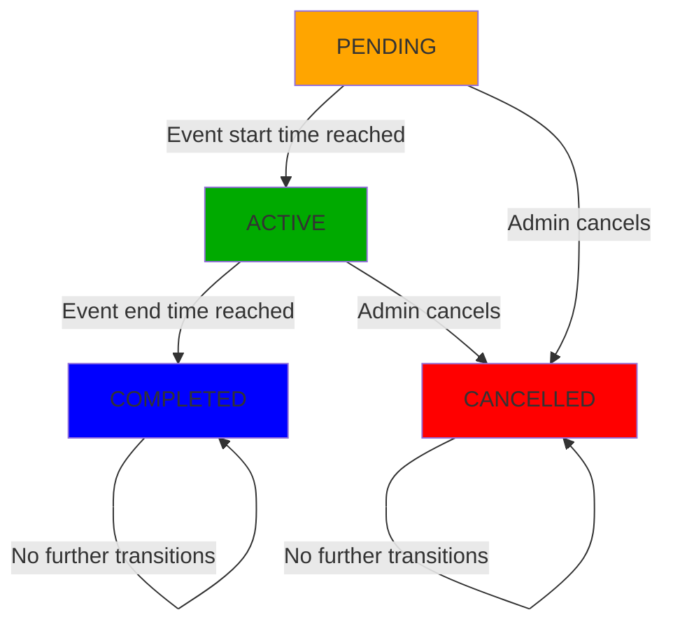

### Status Transition Rules

| From | To | Condition | Auto/Manual |
|-----|----|------------|------------|
| PENDING | ACTIVE | Event start time reached | Auto (scheduled job) |
| PENDING | CANCELLED | Admin action | Manual |
| ACTIVE | COMPLETED | Event end time passed | Auto (scheduled job) |
| ACTIVE | CANCELLED | Admin action (emergency) | Manual |
| COMPLETED | - | No transitions allowed | Immutable |
| CANCELLED | - | No transitions allowed | Immutable |

### Event Registration Status Transitions

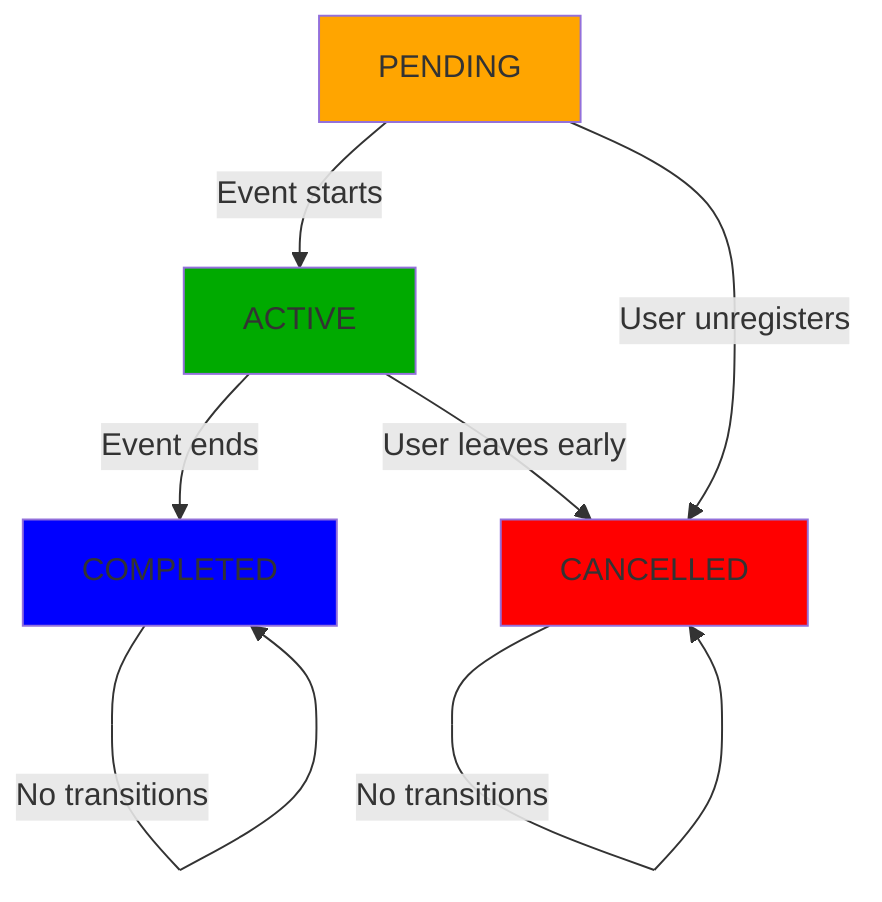

---

## Error Handling Architecture

### Exception Hierarchy

```
Exception
├── BusinessException (4xx errors)
│   ├── ValidationException
│   ├── ResourceNotFoundException
│   ├── DuplicateResourceException
│   ├── UnauthorizedException
│   └── ForbiddenException
├── SystemException (5xx errors)
│   ├── DatabaseException
│   ├── EmailException
│   ├── ExternalServiceException
│   └── InternalServerException
```

### Global Exception Handler

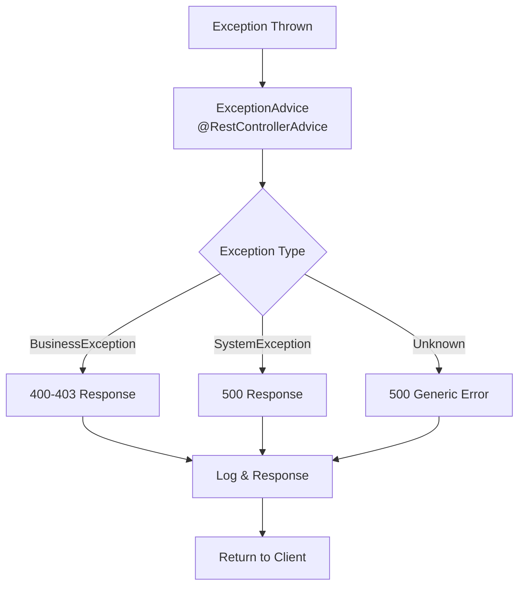

---

## Deployment Architecture

### Development Environment

```
Developer Local Machine
├── Java 17 + Maven
├── MySQL (Docker or Local)
├── IDE (IntelliJ, VS Code)
└── Application (localhost:5050)
```

### Production Environment

```
┌─────────────────────────────────────────────┐
│         CDN (CloudFlare/AWS)                 │
│         (Static assets, images)              │
└────────────────┬────────────────────────────┘
                 │
┌────────────────▼────────────────────────────┐
│      Load Balancer (AWS ALB / Nginx)         │
│      (SSL/TLS termination, routing)          │
└────────────────┬────────────────────────────┘
                 │
    ┌────────────┼────────────┐
    │            │            │
┌───▼────┐  ┌───▼────┐  ┌───▼────┐
│  App   │  │  App   │  │  App   │
│Instance│  │Instance│  │Instance│
│ Pod 1  │  │ Pod 2  │  │ Pod 3  │
└───┬────┘  └───┬────┘  └───┬────┘
    │           │           │
    └───────────┼───────────┘
                │
        ┌───────▼────────────┐
        │  MySQL Database    │
        │  (Master-Slave)    │
        └─────────┬──────────┘
                  │
        ┌─────────▼──────────┐
        │  Redis Cache       │
        │  (Cluster)         │
        └────────────────────┘
```

---

## API Versioning Strategy

```
Current Version: v1 (/api/v1/*)

URI Versioning Pattern:
├── /api/v1/events    (Stable)
├── /api/v2/events    (Future improvements)
└── /api/v3/events    (Major redesign)

Backward Compatibility:
- v1 maintained for 12+ months
- Deprecation notices in response headers
- Migration guide provided before sunset
```

---

## 🔗 Navigation

- ⬆️ [Back to Top](#-ween-backend---architecture--flow-documentation)
- 📋 [Main README](README.md)
- 📖 [Technical Documentation](DOCS.md)

---

**Last Updated**: April 2026  
**Architecture Version**: 1.0  
**Diagrams**: Mermaid.js  
**Maintained By**: Ween Architecture Team
