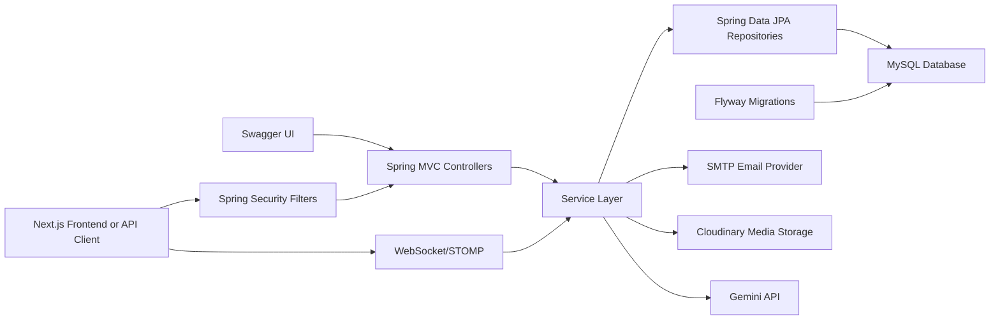
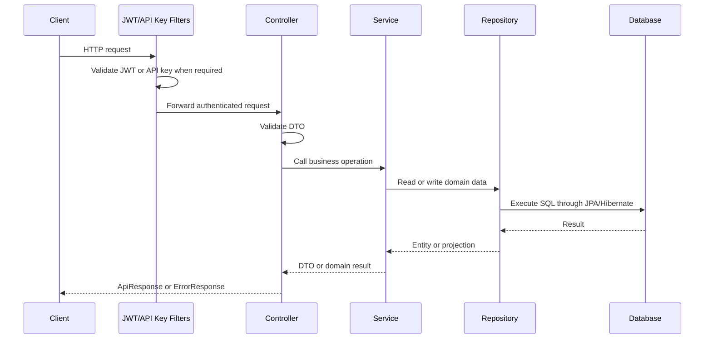
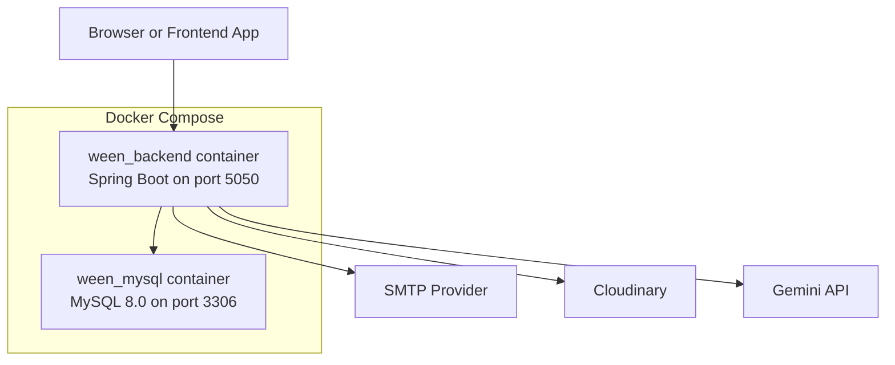

# Architecture

This document describes the backend architecture of the Ween Youth Volunteering and Social Impact Platform.

## High-Level Architecture

## Layer Responsibilities

| Layer | Package | Responsibility |
| --- | --- | --- |
| Controllers | `com.ween.controller` | HTTP endpoints, request validation entry points, response wrapping |
| Services | `com.ween.service` | Business rules, authorization ownership checks, orchestration |
| Repositories | `com.ween.repository` | Database access through Spring Data JPA |
| Entities | `com.ween.entity` | Persistent domain model |
| DTOs | `com.ween.dto` | Request and response contracts |
| Mappers | `com.ween.mapper` | Entity-to-DTO transformation |
| Security | `com.ween.security` | JWT validation, API key checks, AES helper, current user lookup |
| Config | `com.ween.config` | Spring Security, CORS, OpenAPI, WebSocket, integration configuration |
| Exceptions | `com.ween.exception` | Custom exceptions and global error responses |

## Request Lifecycle

## Main Modules

### Authentication and Users

Authentication is handled by `AuthController`, `AuthService`, `JwtUtil`, `JwtAuthenticationFilter`, and `UserDetailsServiceImpl`. The module supports volunteer registration, organization registration, login, refresh, logout, email verification, password reset, and password change.

### Events and Participation

`EventController`, `EventRegistrationController`, `ParticipationController`, `EventService`, `RegistrationService`, and `ParticipationService` manage event lifecycle and volunteer attendance. Events can be created and maintained by organization roles. Volunteers can register for published events and verify attendance through QR-based participation flows.

### Organizations

`OrganizationController` and `OrganizationInvitationController` manage organization profiles and organizer invitation workflows. Admin endpoints support verification and rejection of organizations.

### Social Layer

`PostController`, `FollowController`, and `ChatController` support a social experience around volunteer impact. Users can create posts, comment, like, save, repost, follow other users, and communicate through direct or room-based messages.

### Impact and Rewards

`CoinController`, `LeaderboardController`, `BadgeService`, `CertificateService`, and `ReferralService` manage measurable volunteer impact. The backend records coin transactions, leaderboard rankings, badges, certificates, and referral rewards.

### Administration

`AdminController` exposes protected `ADMIN` endpoints for platform moderation, statistics, badge management, user role changes, organization verification, coin adjustments, audit logs, content moderation, and AI usage statistics.

## Deployment View

## Design Decisions

- The backend uses a layered architecture because it keeps controllers thin and keeps business rules testable in services.
- DTOs are used for request and response handling to avoid exposing persistence entities as the public API contract.
- JWT authentication is stateless, which simplifies frontend integration and horizontal deployment.
- Role-based authorization is enforced in both `SecurityConfig` URL rules and method-level `@PreAuthorize` checks where endpoint-specific restrictions are needed.
- Flyway migrations make schema changes reproducible across local, test, and deployed environments.
- Swagger/OpenAPI is enabled so frontend developers and graders can inspect the API contract without reading source code.
