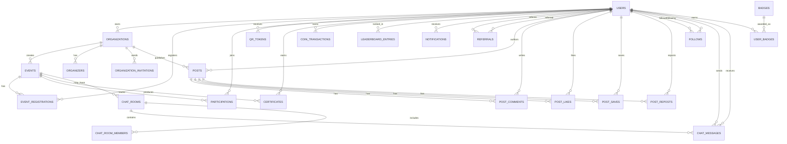

# Entity Relationship Diagram

This document summarizes the Ween database model. The schema is managed by Flyway migrations in `src/main/resources/db.migration` and JPA entities in `src/main/java/com/ween/entity`.

## Core ERD

## Main Tables

| Table | Purpose |
| --- | --- |
| `users` | Volunteer and platform user profiles, credentials, role, verification, profile details, coin balance |
| `organizations` | Organization accounts, owner, verification state, public profile fields |
| `events` | Volunteer events with category, location, date range, capacity, organization, and status |
| `event_registrations` | User registration records for events |
| `participations` | Attendance and check-in participation status |
| `qr_tokens` | Short-lived QR token records for secure attendance verification |
| `certificates` | Certificate records linked to a user and event |
| `coin_transactions` | Ween Coin earning and adjustment history |
| `leaderboard_entries` | Calculated ranking entries |
| `notifications` | User notification records and read state |
| `referrals` | Referral relationships and reward state |
| `posts`, `post_comments`, `post_likes`, `post_saves`, `post_reposts` | Social feed and engagement data |
| `follows` | User follow graph |
| `chat_rooms`, `chat_messages`, `group_chat_messages`, `chat_room_members` | Chat data |
| `badges`, `user_badges` | Badge definitions and user badge awards |
| `organization_invitations`, `organizers` | Organization membership workflow |
| `audit_logs` | Admin and platform audit history |
| `ai_chat_messages` | AI chat history |
| `email_verification_tokens`, `password_reset_tokens` | Account recovery and verification tokens |

## Key Constraints

- Users have unique `username`, `email`, and `referral_code`.
- Organizations have unique `username` and `email`.
- Event registrations prevent duplicate user registration for the same event.
- Participations prevent duplicate user participation for the same event.
- Certificates prevent duplicate certificate creation for the same user and event.
- Referrals prevent the same referrer and referred user pair from being duplicated.
- Foreign keys cascade dependent records where appropriate, such as deleting a user or event.

## Important Enums

| Enum | Values |
| --- | --- |
| `UserRole` | `VOLUNTEER`, `ORGANIZER`, `ORGANIZATION_ADMIN`, `ADMIN` |
| `EventStatus` | `DRAFT`, `PUBLISHED`, `REGISTRATION_CLOSED`, `ONGOING`, `COMPLETED`, `CANCELLED` |
| `ParticipationStatus` | `JOINED`, `APPROVED`, `FINISHED`, `CANCELLED` |
| `EventCategory` | `HUMAN_RIGHTS`, `ENVIRONMENT`, `EDUCATION`, `HEALTH`, `TECHNOLOGY`, `CULTURE`, `INTERNATIONAL` |
| `CoinReason` | `SIGNUP`, `REGISTRATION`, `ATTENDANCE`, `CERTIFICATE`, `PROFILE_COMPLETE`, `REFERRAL`, `INTERNATIONAL`, `LEADERBOARD_BONUS`, `ANNUAL_ACHIEVEMENT` |
