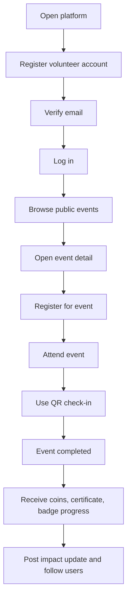
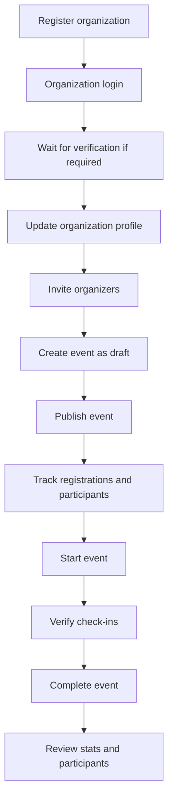
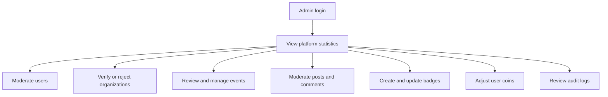
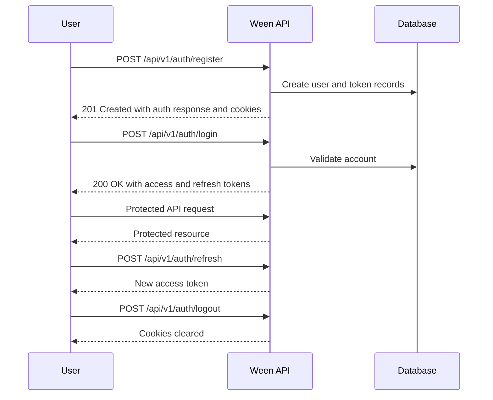
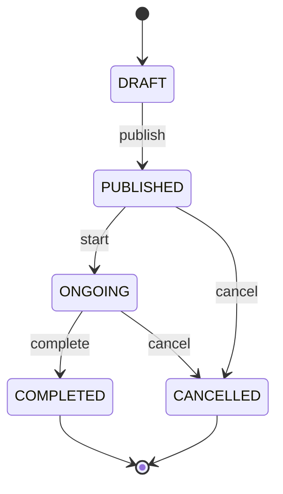
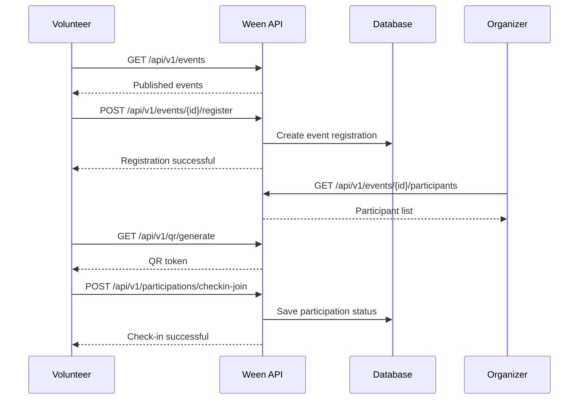

# User Flow

This document describes the primary user journeys supported by the Ween backend.

## Volunteer Journey

## Organization Journey

## Admin Journey

## Authentication Flow

## Event Lifecycle

## Volunteer Event Registration Flow

